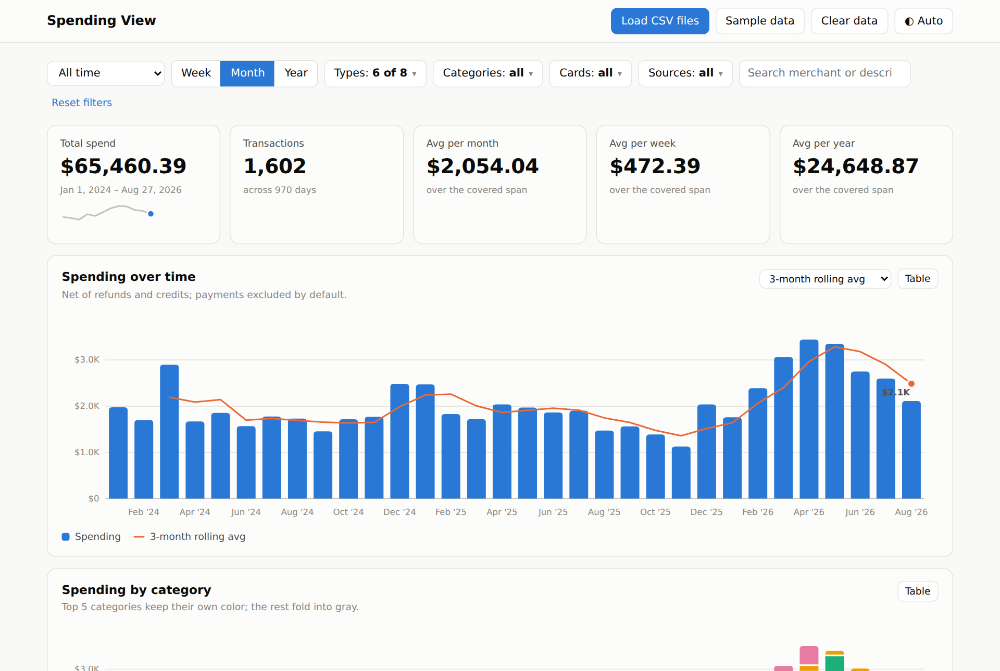

# Spending View

Visualize personal spending for insights — entirely in the browser, from the
CSV exports your card issuers already give you. No build step, no server, no
dependencies; your transaction data never leaves the page.



## Run it

Open `index.html` in a browser, or serve the folder:

```sh
python3 -m http.server 8000
# then visit http://localhost:8000
```

Click **Sample data** to explore with the bundled mock dataset, or **Load CSV
files** (or drag & drop) to import your own exports.

## Supported CSV formats

Formats are detected automatically from the header row, and multiple files are
merged into one view:

| Format | Columns |
|---|---|
| **Apple Card export** | `Transaction Date, Clearing Date, Description, Merchant, Category, Type, Amount (USD), Purchased By` |
| **Generic card export** | `Transaction Date, Posted Date, Description, Amount, Card Last 4, Name on Card, Raw Merchant Name` |

For the generic format (which has no category column) transaction types are
inferred (payments, interest, fees, balance transfers, refunds) and purchases
are auto-categorized by keyword rules — your overrides always win.

## Features

- **Breakdowns by week, month, and year** — spending-over-time columns with a
  configurable rolling average (3/6/12 months, 4/8/13/26 weeks), plus a
  stacked category view and a top-merchants chart. Every chart has a table
  view.
- **Averages** — per-year, per-month, per-week and per-day averages over the
  covered span, and a per-calendar-year table (partial years averaged over the
  days they cover).
- **Filtering** — date-range presets and custom ranges, transaction types
  (payments and balance transfers excluded by default so charts show real
  spending), categories, cards, sources, merchant labels, and free-text
  search. Filters scope every chart, stat and table on the page.
- **Merchant table** — every merchant with count, total, average and
  first/last seen; sortable and searchable.
- **Customization** (saved in your browser's localStorage):
  - override any merchant's category;
  - create your own categories and assign them;
  - tag merchants with free-form labels and filter by them;
  - exclude merchants from all charts and totals (reversible).
- **Metadata panel** — everything else the CSVs carry: posting/clearing lag,
  per-card charge totals, purchaser names, source category lists, and
  locations parsed from Apple Card transaction descriptions.

## Repository layout

```
index.html            app shell
css/styles.css        chrome + light/dark theme tokens
js/namespace.js       shared utilities (formatting, dates, DOM helpers)
js/csv.js             CSV parser
js/parsers.js         format detection + normalization to one transaction model
js/analytics.js       filtering, aggregation, rolling averages, merchant stats
js/charts.js          hand-rolled SVG charts (columns, stacks, bars, sparklines)
js/store.js           localStorage persistence
js/app.js             UI controller
js/mock-data.js       generated sample dataset (embedded)
data/*.csv            the same sample dataset as importable files
scripts/generate-mock-data.mjs   deterministic mock-data generator
```

The repository contains **only mock data** (fictional merchants, people and
card numbers), regenerable with:

```sh
node scripts/generate-mock-data.mjs
```

## Privacy

Parsing, aggregation and rendering all happen client-side. Imported files and
your customizations are persisted only to your browser's localStorage
(**Clear data** removes the dataset; category overrides, labels and exclusions
are kept separately).
